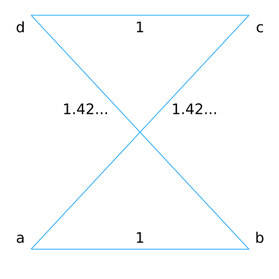
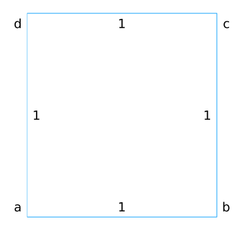

## Pytania i odpowiedzi
#### Jak duże jest otoczenie _invert_?
_Invert_ polega na odwróceniu wszystkich wierzchołków pomiędzy $i$ i $j$. Możliwych wyborów $i$ i $j$ jest ${n \choose 2} = \frac{n(n-1)}{2}$.

Jednak jedna para $i = 1, j = n$ nie jest właściwa, bo jej wynikiem jest taki sam cykl. Ostatecznie więc rozmiarem otoczenia jest $\frac{n(n-1)}{2} - 1$.

#### Czemu algorytm _local search_ oparty o _invert_ zwróci rozwiązanie przez krzyżujących się krawędzi?
Każde rozplątanie krzyżujących się krawędzi da nam lepsze rozwiązanie od tego na które patrzymy.

Algorytm _local search_ kończy działanie tylko wtedy, gdy z danego rozwiązania nie da się już dojść do lepszego od niego, więc też takie rozwiązanie nie mogłoby mieć żadnych krzyżujących się krawędzi.

#### Czemu przy zaokrąglaniu odległości to nie jest prawda?
Z racji że $\sqrt{2} \approx 1.42...$ zaokrągla się do 1, cykl "abcd" ma tą samą wagę co cykl "abdc", więc przecięcie krawędzi nie zostanie naprawione w tym algorytmie.

## Wyniki zadania 1.
|Test|Optymalna ścieżka|Waga MST|Najmniejszy znaleziony cykl|Średnia długość cykli|Średnia liczba popraw|
|------|------|------|------|------|------|
|xqf131|564|474|597|616.0|27.73|
|xqg237|1019|897|1057|1093.0|41.27|
|pma343|1368|1179|1444|1470.44|74.11|
|pka379|1332|1151|1394|1411.74|82.79|
|bcl380|1621|1444|1727|1776.84|61.16|
|pbl395|1281|1124|1349|1373.32|84.05|
|pbk411|1343|1180|1414|1430.8|88.05|
|pbn423|1365|1201|1448|1471.15|90.65|
|pbm436|1443|1269|1545|1567.8|104.4|
|xql662|2513|2240|2691|2730.32|137.68|
|xit1083|3558|3253|3833|3888.22|206.19|
|icw1483|4416|4015|4792|4833.74|286.66|
|djc1785|6115|5541|6471|6520.79|385.02|
|dcb2086|6600|5950|7087|7152.22|419.42|
|pds2566|xxx|6956|8216|8291.22|471.38|

## Wyniki zadania 2.
|Test|Optymalna ścieżka|Najmniejszy znaleziony cykl|Średnia długość cykli|Średnia liczba popraw|
|------|------|------|------|------|
|xqf131|564|572|611.84|132.92|
|xqg237|1019|1066|1116.87|260.37|
|pma343|1368|1427|1482.43|404.08|
|pka379|1332|1398|1446.53|447.93|
|bcl380|1621|1712|1816.55|448.48|
|pbl395|1281|1346|1427.07|459.17|
|pbk411|1343|1416|1489.8|483.69|
|pbn423|1365|1454|1521.0|497.03|
|pbm436|1443|1532|1609.67|512.93|
|xql662|2513|2701|2814.83|810.97|
|xit1083|3558|3934|4017.41|1385.03|
|icw1483|4416|4866|4981.9|1926.87|
|djc1785|6115|6741|6871.49|2348.5|
|dcb2086|6600|7344|7472.49|2794.36|
|pds2566|xxx|8511|8677.17|3489.37|

## Wyniki zadania 3.
|Test|Optymalna ścieżka|Najmniejszy znaleziony cykl|Średnia długość cykli|Średnia liczba popraw|
|------|------|------|------|------|
|xqf131|564|831|1051.5|111.94|
|xqg237|1019|1721|2109.92|223.57|
|pma343|1368|2293|2845.25|365.73|
|pka379|1332|2257|2794.6|406.12|
|bcl380|1621|3111|3813.81|376.17|
|pbl395|1281|2339|2979.88|384.42|
|pbk411|1343|2581|3144.72|407.04|
|pbn423|1365|2538|3186.19|420.24|
|pbm436|1443|2702|3372.57|432.97|
|xql662|2513|4781|6060.39|694.49|
|xit1083|3558|7498|9148.59|1202.65|
|icw1483|4416|9205|11452.4|1693.14|
|djc1785|6115|12697|15579.75|2060.76|
|dcb2086|6600|14772|17816.1|2454.82|
|pds2566|xxx|17350|21327.93|3056.83|